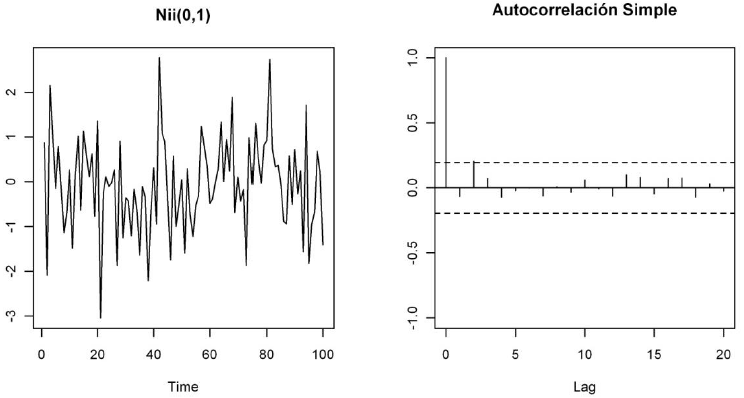

## Curso de Deep Learning sobre series de tiempo ML Community Perú

### Tabla de contenidos
=================

* [Introducción](https://github.com/FidelAlberto/time-series-course-for-MLCommunity/tree/main/Introduccion)
* [Correlación](https://github.com/FidelAlberto/time-series-course-for-MLCommunity/tree/main/correlation)
* [Autocorrelación](https://github.com/FidelAlberto/time-series-course-for-MLCommunity/tree/main/Autocorrelaci%C3%B3n)
* [Time Series Analysis](https://github.com/FidelAlberto/time-series-course-for-MLCommunity/tree/main/Time%20Series%20Analysis)
	* Correlation and Autocorrelation
 	* Time Series Models
    	* Autoregressive (AR) Models
       	* Moving Average (MA) and ARMA Models

## Introducción

Una serie temporal es una colección de observaciones de una variable tomadas de forma secuencial y ordenada en el tiempo (instantes de tiempo equiespaciados). Las series pueden tener una periodicidad anual, semestral, trimestral, mensual, etc., según los periodos de tiempo en los que están recogidos los datos que la componen. Las series temporales se pueden definir como un caso particular de los procesos estocásticos, ya que un proceso estocástico es una secuencia de variables aleatorias, ordenadas y equidistantes cronológicamente referidas a una característica observable en diferentes momentos.

Algunos ejemplos de series temporales vienen de campos como la economía (producto interior bruto anual, tasa de inflación, tasa de desempleo, ...),  la demografía (nacimientos anuales, tasa de dependencia, ...), la meteorología (temperaturas máximas, medias o mínimas, precipitaciones diarias, ...), etc.

El objetivo de una serie temporal reside en estudiar los cambios en esa variable con respeto al tiempo (descripción), y en predecir sus valores futuros (predicción). Por lo tanto, el análisis de series temporales presenta un conjunto de técnicas estadísticas que permiten extraer las regularidades que se observan en el comportamiento pasado de la variable, para tratar de predecir el comportamiento futuro.

Una serie temporal se representa mediante un gráfico temporal, con el valor de la serie en el eje de ordenadas y los tiempos en el eje de abscisas. Esta es la forma más sencilla de comenzar el análisis de una serie temporal y permite detectar las características y componentes más importantes de una serie. 

**Componentes de una serie temporal**

Los componentes que forman una serie temporal son los siguientes:

- Tendencia: Se puede definir como un cambio a largo plazo que se produce en relación al nivel medio, o el cambio a largo plazo de la media. La tendencia se identifica con un movimiento suave de la serie a largo plazo.
- Estacionalidad: Se puede definir como cierta periodicidad de corto plazo, es decir, cuando se observa en la serie un patrón sistemático que se repite periódicamente (cada año, cada mes, etc., dependiendo de las unidades de tiempo en que vengan recogidos los datos). Por ejemplo, el paro laboral aumenta en general en invierno y disminuye en verano. 
- Ciclo: Similar a la estacionalidad, ya que se puede definir como una fluctuación alrededor de la tendencia, pero de una duración irregular (no estrictamente periódica).
- Irregular: Son factores que aparecen de forma aleatoria y que no responden a un comportamiento sistemático o regular y por tanto no pueden ser predecidos. No se corresponden a la tendencia ni a la estacionalidad ni a los ciclos.

**Tipos de series temporales**

Además, las series temporales se pueden dividir en:

- Estacionarias: es aquella en la que las propiedades estadísticas de la serie son estables, no varían con el tiempo, más en concreto su media, varianza y covarianza se mantienen constantes a lo lardo del tiempo. Si una serie temporal tiene una media constante a lo largo del tiempo, decimos que es estacionaria con respecto a la media. Si tiene varianza constante con respecto al tiempo, decimos que es estacionaria en varianza.
- No estacionarias: son aquellas en las que las propiedades estadísticas de la serie sí varían con el tiempo. Estas series pueden mostrar cambio de varianza, tendencia o efectos estacionales a lo largo del tiempo. Una serie es no estacionaria en media cuando muestra una tendencia, y una serie es no estacionaria en varianza cuando la variabilidad de los datos es diferente a lo largo de la serie.

La importancia de esta división reside en que la estacionaridad (en media y en varianza) es un requisito que debe cumplirse para poder aplicar modelos paramétricos de análisis y predicción de series de datos. Ya que con series estacionarias podemos obtener predicciones fácilmente, debido a que como la media es constante se puede estimar con todos los datos y utilizar este valor para predecir una nueva observación. Y también permite obtener intervalos de confianza para las predicciones. 

Un tipo especial de serie estacionaria es la serie denominada **ruido blanco**. Un ruido blanco es una serie estacionaria tal que ninguna observación influye sobre las siguientes, es decir, donde los valores son independientes e idénticamente distribuidos a lo largo del tiempo con media y covarianza cero e igual varianza.

Otro tipo especial de serie temporal es la llamada **camino aleatorio**, una serie es un camino aleatorio si la primera diferenciación de la serie es un ruido blanco.

Las series temporales también se pueden dividir según cuántas variables se observan o según su variabilidad:

- Univariante: la serie temporal es un conjunto de observaciones sobre una única caracteristica o variable.
- Multivariante: (o vectorial): la serie temporal es un conjunto de observaciones de varias variables.  
 
- Homocedástica: una serie es homocedástica si su variabilidad se mantiene constante a lo largo de la serie.
- Heterocedástica: una serie es heterocedástica cuando la variabilidad de la serie aumenta o disminuye a lo largo del tiempo.

Por otro lado, la variable que se observa en una serie temporal puede ser de tipo:

- Flujo: variable cuya cantidad es acumulada a lo largo del tiempo, por ejemplo: inversión, ahorro, etc.
- Stock: variable cuya cantidad se mide en un determinado momento del tiempo, por ejemplo: población, nº parados, etc.
